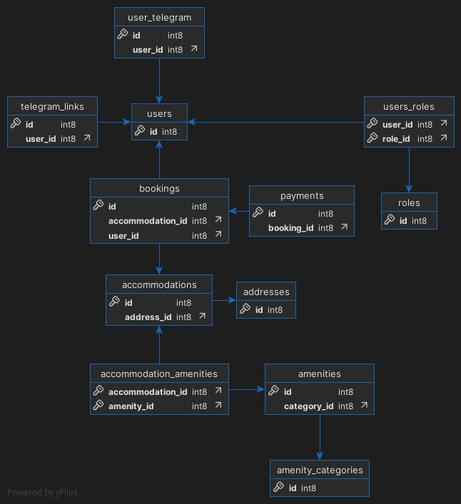

# Booking App

📚 **Description**

The Booking App is a robust and user-friendly Java web application designed to manage accommodations, bookings, and payments. This project showcases how modern Java frameworks and libraries can come together to create a scalable and efficient software solution.

The application includes user authentication, Telegram bot integration, Stripe payment processing, API documentation, database integrations, and controller-based functionalities tailored to enhance the user experience. The project demonstrates strong coding practices, making it a great example for presenting technical proficiency.

## 🚀 Features

- **User Authentication**: Secure user login and registration using Spring Security and JWT.
- **RESTful API**: Well-structured APIs for CRUD operations on accommodations, bookings, and payments.
- **Database Management**: Integrated with PostgreSQL and supported by Liquibase for database migrations.
- **OpenAPI Documentation**: Explore the API endpoints conveniently using Springdoc Swagger.
- **Telegram Bot Integration**: Notifications and interactions via Telegram.
- **Payment Processing**: Secure payment handling with Stripe integration.
- **Validation and Error Handling**: Input validation with detailed error messages.
- **Scalability**: Modular and extendable architecture with Spring Boot's framework.
- **Development Efficiency**: Features hot reloading through Spring Boot DevTools.

## 🛠️ Technologies Used

This project leverages the following technologies and tools:

- **Java 17**: The core programming language.
- **Spring Framework (v3.4.4)**:
  - Spring Boot
  - Spring Data JPA
  - Spring Security
  - Spring MVC
- **Database**:
  - PostgreSQL 17
  - Liquibase (Database migration tool): v4.29.2
- **API Documentation**:
  - SpringDoc OpenAPI & Swagger UI: v2.8.5
- **JWT (io.jsonwebtoken)**: v0.12.6. JSON Web Tokens for authentication.
- **Lombok**: v1.18.36. Simplified Java development with reduced boilerplate.
- **MapStruct**: v1.5.5.Final. For converting entities to DTOs and vice versa.
- **Telegram Bot**: v6.9.7.1. For Telegram integration.
- **Stripe Java**: v29.1.0. For payment processing.
- **Docker Compose**: For containerized and simplified deployment.
- **TestContainers**: For integration testing with containerized databases.
- Additional tools like Maven for builds and Git for version control.

## 👤 Controller Functionalities

### Auth Controller

The Auth Controller handles registration and authentication processes for users.

**Endpoints**:
- `POST /register` — Allows new users to sign up by providing their email, password, and personal details.
- `POST /login` — Authenticates a user and provides a JWT for accessing protected endpoints.

### Accommodation Controller

The Accommodation Controller manages the creation, retrieval, search, update, and deletion of accommodations with role-based access control.

**Endpoints**:
- `POST /accommodations` — Creates new accommodation in the system. Access: Restricted to administrators with the role ROLE_ADMIN.
- `GET /accommodations` — Retrieves a paginated list of all accommodations.
- `GET /accommodations/{id}` — Retrieves detailed information for specific accommodation by its ID.
- `PUT /accommodations/{id}` — Updates an existing accommodation's details. Access: Restricted to administrators with the role ROLE_ADMIN.
- `DELETE /accommodations/{id}` — Deletes specific accommodation by its ID. Access: Restricted to administrators with the role ROLE_ADMIN.

### Booking Controller

The Booking Controller manages the creation, retrieval, and updating of bookings. It supports both user-specific operations and administrative tasks.

**Endpoints**:
- `POST /bookings` — Creates a new booking. Access: Available to authenticated users with the role ROLE_USER.
- `GET /bookings` — Retrieves a paginated list of all bookings by parameters. Access: Available to authenticated users with the role ROLE_ADMIN.
- `GET /bookings/my` — Retrieves all bookings for the current user. Access: Available to authenticated users with the role ROLE_USER.
- `GET /bookings/{id}` — Retrieves details of a specific booking. Access: Available to authenticated users with the role ROLE_USER.
- `PUT /bookings/{id}` — Updates an existing booking. Access: Available to the owner of the booking.
- `DELETE /bookings/{id}` — Cancels a booking. Access: Available to the owner of the booking.

### Payment Controller

The Payment Controller handles payment processing for bookings using Stripe integration.

**Endpoints**:
- `GET /payments` — Retrieves payments based on user ID. Access: Available to the owner of the booking or administrators.
- `POST /payments` — Creates a new payment session. Access: Available to authenticated users with the role ROLE_USER.
- `POST /payments/renew` — Renew a payment. Access: Available to authenticated users with the role ROLE_USER.
- `GET /payments/success` — Handles successful payment callbacks.
- `GET /payments/cancel` — Handles canceled payment callbacks.

### User Controller

The User Controller manages user profile information and settings.

**Endpoints**:
- `GET /users/me` — Retrieves the current user's profile information. Access: Available to authenticated users.
- `PUT /users/me` — Updates the current user's profile information. Access: Available to authenticated users.
- `PATCH /users/{id}/role` — Update a user's role by ID. Access: Available to authenticated users.

### Amenity Controller

The Amenity Controller manages the creation, retrieval, update, and deletion of amenities for accommodations.

**Endpoints**:
- `GET /amenities` — Retrieves a list of all amenities.
- `GET /amenities/{id}` — Retrieves detailed information for a specific amenity by its ID.
- `POST /amenities` — Creates a new amenity in the system. Access: Restricted to administrators with the role ROLE_ADMIN.
- `PUT /amenities/{id}` — Updates an existing amenity's details. Access: Restricted to administrators with the role ROLE_ADMIN.
- `DELETE /amenities/{id}` — Deletes a specific amenity by its ID. Access: Restricted to administrators with the role ROLE_ADMIN.

### Amenity Category Controller

The Amenity Category Controller manages the creation, retrieval, update, and deletion of amenity categories.

**Endpoints**:
- `GET /amenity-category` — Retrieves a list of all amenity categories.
- `GET /amenity-category/{id}` — Retrieves detailed information for a specific amenity category by its ID.
- `POST /amenity-category` — Creates a new amenity category in the system. Access: Restricted to administrators with the role ROLE_ADMIN.
- `PUT /amenity-category/{id}` — Updates an existing amenity category's details. Access: Restricted to administrators with the role ROLE_ADMIN.
- `DELETE /amenity-category/{id}` — Deletes a specific amenity category by its ID. Access: Restricted to administrators with the role ROLE_ADMIN.

### Telegram Link Controller

The Telegram Link Controller manages the integration between user accounts and Telegram for notifications.

**Endpoints**:
- `POST /telegram/link` — Generates a deep link for binding a user's Telegram account to their application profile.
- `GET /telegram/status` — Checks whether Telegram notifications are enabled for the authenticated user.
- `DELETE /telegram/link` — Unlinks the Telegram account associated with the authenticated user's account.

## 📋 Prerequisites

Ensure the following tools are installed on your machine:

- Java: JDK 17+.
- Build Tool: Maven (used in this project).
- Docker version 20+
- Docker Compose version 2.5+

## 📝 Setup Instructions

### Step 1: Clone the repository
```bash
  git clone git@github.com:chertiav/booking-app.git
  cd booking-app
```

### Step 2: Configure the .env File
In the root directory of the project, create a new file named `.env`.
This file will store the environment variables necessary to configure the database and application.

Add the following variables to the `.env` file based on the provided template:

```
# PostgreSQL Configuration
POSTGRES_USER=your_postgres_user
POSTGRES_PASSWORD=your_postgres_password
POSTGRES_DB=booking_db
POSTGRES_LOCAL_PORT=5432
POSTGRES_DOCKER_PORT=5432

# Spring Boot Configuration
SPRING_LOCAL_PORT=8080
SPRING_DOCKER_PORT=8080
DEBUG_PORT=5005

# JWT Configuration
JWT_EXPIRATION=86400000
JWT_SECRET=your_jwt_secret_key

# Telegram Bot Configuration
TELEGRAM_BOT_TOKEN=your_telegram_bot_token
TELEGRAM_BOT_USERNAME=your_telegram_bot_username

# Scheduler Configuration
SCHEDULER_CRON_HOURLY=0 0 * * * *
SCHEDULER_CRON_DAILY_NINE=0 0 9 * * *
SCHEDULER_CRON_MINUTE=0 * * * * *
SCHEDULER_CRON_TIME_ZONE=Europe/Kiev

# Stripe Configuration
STRIP_SECRET_KEY=your_stripe_secret_key
STRIP_CURRENCY=USD

# Application Base URL
APP.BASE.URL=http://localhost:8080/api
```

Replace the placeholders with actual values. For example:
```
POSTGRES_USER=admin
POSTGRES_PASSWORD=securepassword
JWT_SECRET=abcdefghijklmnopABCDEFGHIJKLMNOP12345678
```

**Descriptions of Required Variables**:
- `POSTGRES_USER` — The username for the PostgreSQL database.
- `POSTGRES_PASSWORD` — Password for the PostgreSQL database user.
- `POSTGRES_DB` — The name of the database used by the application.
- `JWT_SECRET` — A secure key used to sign JWT tokens. Ensure this is a strong and unique value.
- `TELEGRAM_BOT_TOKEN` — Token for your Telegram bot (obtained from BotFather).
- `TELEGRAM_BOT_USERNAME` — Username of your Telegram bot.
- `STRIP_SECRET_KEY` — Your Stripe API secret key for payment processing.

**Additional Notes**:
- The variable `POSTGRES_LOCAL_PORT` specifies the port used locally to connect to the database, while `POSTGRES_DOCKER_PORT` specifies the port inside the Docker container.
- `SPRING_LOCAL_PORT`, `SPRING_DOCKER_PORT`, and `DEBUG_PORT` define the ports for the application and debugging.
- Make sure to save the `.env` file and avoid committing it to version control to keep sensitive information secure.

### Step 3: Start the Application
Once the `.env` file is configured, navigate to the project's root directory using the terminal.

Use the following command to start the application and all required services via Docker Compose:

```bash
  docker compose up --build
```

What this does:
- This command builds the Docker images for the application and required services.
- It starts the application, database, and any other dependencies inside containers.
- Wait for the services to start. You should see logs indicating that the application and database are running.

### Step 4: Access the Application
After running the application, you can access it via the following endpoints:

#### 🔧 Local Environment (host machine)
- Base URL: `http://localhost:8088/api`
- Swagger UI: [http://localhost:8088/api/swagger-ui/index.html](http://localhost:8088/api/swagger-ui/index.html)

#### 🐳 Docker Container (inside container network)
- Base URL: `http://localhost:8080/api`
- Swagger UI: [http://localhost:8080/api/swagger-ui/index.html](http://localhost:8080/api/swagger-ui/index.html)

#### ☁️ AWS Deployment (public demo)
- Live Swagger UI: [http://ec2-16-171-144-22.eu-north-1.compute.amazonaws.com/api/swagger-ui/index.html](http://ec2-16-171-144-22.eu-north-1.compute.amazonaws.com/api/swagger-ui/index.html)

> ⚠️ **Note:** The AWS endpoint is available for demonstration purposes only. Please do not use it to submit sensitive or production-level data.

## 📊 Entity Relationships

The application has the following entities and their relationships:

### Core Entities

- **User**: Represents application users with authentication details
  - Has fields for email, first name, last name, password
  - Can have multiple roles (ManyToMany with Role)
  - Can have multiple bookings (OneToMany with Booking)
  - Can be linked to a Telegram account (OneToOne with UserTelegram)
  - Can have multiple temporary Telegram links (OneToMany with TelegramLink)

- **Role**: Represents user roles for authorization
  - Has a name field (e.g., ADMIN, USER)
  - Can be assigned to multiple users (ManyToMany with User)

- **Accommodation**: Represents available accommodations for booking
  - Has fields for type (HOUSE, APARTMENT, CONDO, VACATION_HOME), size, daily rate, availability
  - Has a location (OneToOne with Address)
  - Can have multiple amenities (ManyToMany with Amenity)
  - Can be booked multiple times (OneToMany with Booking)

- **Address**: Represents the location of an accommodation
  - Contains address details (street, city, country, etc.)
  - Is associated with one accommodation (OneToOne with Accommodation)

- **Booking**: Represents a reservation of accommodation for specific dates
  - Has fields for check-in date, check-out date, status (PENDING, CONFIRMED, CANCELED, EXPIRED)
  - Belongs to one user (ManyToOne with User)
  - Is for one accommodation (ManyToOne with Accommodation)
  - Can have multiple payments (OneToMany with Payment)

- **Payment**: Represents payment information for bookings
  - Has fields for status (PENDING, PAID, EXPIRED, CANCELED), session URL, session ID, amount
  - Is associated with one booking (ManyToOne with Booking)

### Amenity-Related Entities

- **Amenity**: Represents features/amenities available at accommodations
  - Has a name and description
  - Belongs to a category (ManyToOne with AmenityCategory)
  - Can be available at multiple accommodations (ManyToMany with Accommodation)

- **AmenityCategory**: Represents categories of amenities
  - Has a name field
  - Can contain multiple amenities (OneToMany with Amenity)

### Telegram Integration Entities

- **UserTelegram**: Represents users connected via Telegram
  - Has a chat ID field for Telegram communication
  - Is linked to one user (OneToOne with User)

- **TelegramLink**: Represents temporary tokens for linking Telegram accounts
  - Has token and expiration time fields
  - Is associated with one user (ManyToOne with User)

### Join Tables

- **users_roles**: Connects users with their roles (ManyToMany)
- **accommodation_amenities**: Connects accommodations with their amenities (ManyToMany)

All entities implement soft delete functionality, allowing for data recovery and maintaining referential integrity.



## 📂 Postman Collection

You can find a Postman collection in `docs/booking-app-api.postman_collection.json`. To use this:

- Import the file into Postman.
- Adjust Authorization headers (use JWT obtained from the login endpoint).
- Test all exposed APIs such as authentication, book management, and more.

## 🛠 Obstacles & Solutions

**Challenge**: Integrating Telegram Bot
- **Problem**: Setting up real-time notifications for booking events.
- **Solution**: Implemented a Telegram bot with Spring's scheduling capabilities to send timely notifications.

**Challenge**: Payment Processing
- **Problem**: Securely handling payment information and processing.
- **Solution**: Integrated Stripe API for secure payment handling without storing sensitive payment details.

**Challenge**: Managing Booking Availability
- **Problem**: Preventing double bookings and managing accommodation availability.
- **Solution**: Implemented database constraints and service-layer validation to ensure booking integrity.

## 👥 Contributions

We welcome contributions to enhance the project! To contribute:

1. Fork the repository.
2. Create a branch:
```bash
   git checkout -b new-feature
```
3. Commit your changes:
```bash
   git commit -m "Add new feature"
```
4. Test your changes.
5. Submit a pull request.

## 📜 License

This project is licensed under the MIT License.

## 📧 Contact

Feel free to reach out for feedback or questions:

- **Email**: [chertaiv@gmail.com]
- **GitHub**: [GitHub Profile](https://github.com/chertiav)